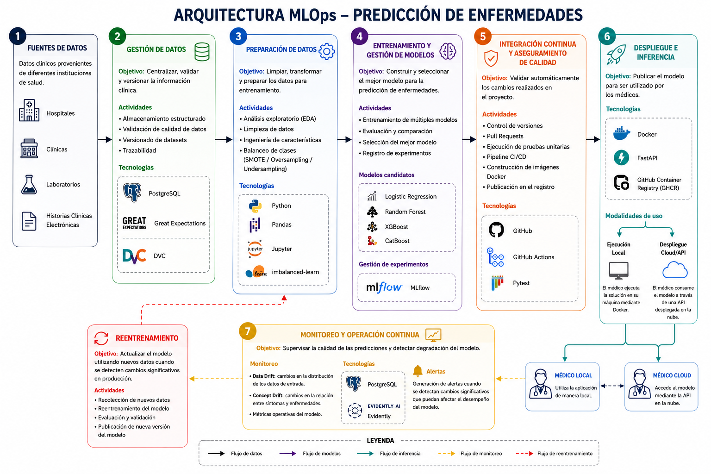

# Pipeline MLOps para Predicción de Enfermedades Comunes y Huérfanas

## Tabla de Contenido

1. Introducción
2. Objetivos del Sistema
3. Suposiciones
4. Arquitectura MLOps Propuesta
5. Tecnologías Seleccionadas y Justificación
6. Mejoras Futuras y Escalabilidad
7. Conclusiones
8. Diagrama General del Pipeline

---

# 1. Introducción

La medicina moderna genera una gran cantidad de información proveniente de historias clínicas electrónicas, laboratorios, exámenes diagnósticos y registros hospitalarios.

Sin embargo, existe un reto importante: mientras algunas enfermedades comunes cuentan con una gran cantidad de registros históricos, las enfermedades huérfanas poseen una cantidad limitada de ejemplos disponibles. Esta situación genera conjuntos de datos desbalanceados donde algunas categorías tienen una representación significativamente mayor que otras.

El objetivo de esta propuesta es definir una arquitectura MLOps completa que permita desarrollar, desplegar, monitorear y mantener un sistema de predicción de enfermedades basado en Machine Learning, garantizando trazabilidad, reproducibilidad, calidad de datos y facilidad de operación tanto en entornos locales como en la nube.

---

# 2. Objetivos del Sistema

El sistema debe ser capaz de:

- Predecir la posible categoría de enfermedad a partir de síntomas y características clínicas de un paciente.
- Soportar tanto enfermedades comunes como enfermedades huérfanas.
- Permitir ejecución local mediante Docker.
- Permitir despliegue remoto mediante una API accesible por red.
- Mantener trazabilidad completa de datasets, modelos y experimentos.
- Detectar degradación del modelo una vez desplegado.
- Facilitar el reentrenamiento cuando las condiciones de los datos cambien.

---

# 3. Suposiciones

Debido a que el problema planteado es abierto, se realizan las siguientes suposiciones para el diseño de la arquitectura.

## 3.1 Fuentes de Datos

Se asume que los datos provienen de múltiples fuentes médicas:

- Hospitales
- Clínicas
- Laboratorios
- Sistemas de Historia Clínica Electrónica (EHR)

Los datos pueden presentar diferentes formatos, niveles de calidad y frecuencias de actualización, por lo que será necesario realizar procesos de validación y estandarización antes de utilizarlos.

### Implicaciones

La arquitectura debe contemplar mecanismos de integración y control de calidad que permitan trabajar con información heterogénea.

## 3.2 Privacidad y Anonimización

Se asume que todos los datos utilizados para entrenamiento e inferencia han sido anonimizados previamente.

### Implicaciones

El sistema no almacenará información que permita identificar directamente a un paciente, reduciendo riesgos de privacidad y facilitando el cumplimiento de regulaciones de protección de datos.

## 3.3 Naturaleza del Problema

Se asume que el objetivo corresponde a un problema de clasificación supervisada donde las entradas están compuestas por síntomas, antecedentes clínicos y variables demográficas, mientras que la salida corresponde a una categoría de enfermedad.

### Implicaciones

Los algoritmos seleccionados deben ser adecuados para clasificación multiclase sobre datos tabulares.

## 3.4 Distribución de las Enfermedades

El conjunto de datos contiene tanto enfermedades comunes como enfermedades huérfanas.

Las enfermedades comunes poseen una gran cantidad de registros históricos mientras que las enfermedades huérfanas presentan pocos ejemplos disponibles.

### Implicaciones

Existe un problema de desbalance de clases que debe ser tratado explícitamente durante el entrenamiento para evitar que el modelo favorezca únicamente las enfermedades más frecuentes.

## 3.5 Infraestructura Disponible

Se contemplan dos escenarios de uso.

### Ejecución Local

El médico ejecuta el sistema directamente mediante Docker en su computador.

### Ejecución Remota

El modelo se encuentra desplegado en un servidor o proveedor cloud y es consumido mediante una API.

### Implicaciones

La arquitectura debe soportar ambos mecanismos de despliegue sin necesidad de modificar el modelo ni la lógica de inferencia.

## 3.6 Restricciones Regulatorias

Se asume que cualquier implementación real deberá cumplir las normativas de protección de datos y regulación sanitaria aplicables.

### Implicaciones

Se requiere mantener trazabilidad sobre los datos utilizados, las versiones de modelos desplegadas y las predicciones realizadas.


---

Estructura:

```text
predecir_estado/
│
├── .github/
│   └── workflows/
│       └── workflow.yml
│
├── docs/
│   └── mlops_pipeline.png
│
├── tests/
│   └── test_predictor.py
│
├── CHANGELOG.md
├── README.md
├── Dockerfile
├── predictor.py
├── app_flask.py
├── requirements.txt
└── historial.txt
```

---


# 4. Arquitectura MLOps Propuesta

La arquitectura propuesta busca cubrir el ciclo de vida completo del modelo de Machine Learning, desde la adquisición de los datos clínicos hasta el monitoreo continuo en producción. El objetivo principal es garantizar reproducibilidad, trazabilidad, calidad de datos, facilidad de despliegue y capacidad de evolución del sistema a medida que se incorporen nuevos datos médicos.

La solución se divide en seis grandes bloques:

1. Gestión de Datos.
2. Preparación de Datos.
3. Entrenamiento y Gestión de Modelos.
4. Integración Continua y Aseguramiento de Calidad.
5. Despliegue e Inferencia.
6. Monitoreo y Operación Continua.

---

# Diagrama del Pipeline

El siguiente diagrama muestra la arquitectura MLOps completa propuesta para el sistema de predicción de enfermedades.




El diagrama resume las etapas de gestión de datos, preparación de datos, entrenamiento de modelos, automatización CI/CD, despliegue y monitoreo continuo descritas a lo largo de este documento.

---


## 4.1 Gestión de Datos

La primera etapa del pipeline se encarga de consolidar y preparar la información proveniente de diferentes fuentes médicas. Se asume que los datos pueden provenir de hospitales, clínicas, laboratorios o sistemas de historia clínica electrónica, por lo que es necesario contar con mecanismos que permitan centralizar y controlar la calidad de la información antes de utilizarla para entrenamiento o inferencia.

Los registros clínicos son almacenados inicialmente en PostgreSQL, permitiendo mantener una estructura consistente y trazable para todos los datos utilizados por el sistema. La elección de PostgreSQL se basa en su robustez, amplia adopción en entornos empresariales y facilidad para integrarse con herramientas de análisis y Machine Learning.

Una vez almacenados, los datos pasan por un proceso de validación automática utilizando Great Expectations. Esta herramienta permite definir reglas de calidad reutilizables para verificar aspectos como:

- Existencia de valores obligatorios.
- Detección de valores nulos.
- Verificación de tipos de datos.
- Validación de rangos clínicamente razonables.
- Consistencia entre variables relacionadas.

En aplicaciones médicas, donde un error de captura puede afectar significativamente el desempeño del modelo, esta etapa resulta fundamental para garantizar la confiabilidad del sistema.

Posteriormente, los datasets validados son versionados mediante DVC. A diferencia del desarrollo tradicional de software, en Machine Learning no solo es necesario controlar versiones del código, sino también de los datos utilizados para entrenar los modelos. DVC permite identificar exactamente qué versión del dataset fue utilizada para generar cada modelo, facilitando la reproducibilidad y auditoría de los resultados obtenidos.

### Tecnologías Utilizadas

- PostgreSQL
- Great Expectations
- DVC

---

## 4.2 Preparación de Datos

Una vez que los datos han sido validados y versionados, se inicia la fase de preparación y análisis.

En esta etapa se utilizan Python, Pandas y Jupyter Notebook para realizar análisis exploratorio de datos, identificar patrones, detectar posibles inconsistencias adicionales y construir nuevas variables que puedan aportar valor predictivo al modelo.

Este proceso incluye:

- Limpieza de registros.
- Transformación de variables.
- Tratamiento de valores faltantes.
- Generación de características derivadas.
- Análisis estadístico.
- Visualización de datos.

La exploración de los datos permite comprender mejor la distribución de las enfermedades, identificar posibles sesgos y detectar variables relevantes para el proceso de predicción.

### Manejo del Desbalance de Clases

Una consideración importante del problema planteado es la coexistencia de enfermedades comunes y enfermedades huérfanas.

Mientras las enfermedades comunes cuentan con una gran cantidad de registros históricos, las enfermedades huérfanas presentan pocos ejemplos disponibles. Esto genera un problema de desbalance de clases que puede provocar que el modelo aprenda principalmente las enfermedades más frecuentes e ignore aquellas menos representadas.

Para mitigar este riesgo se propone utilizar la librería `imbalanced-learn`, implementando técnicas como:

- Oversampling.
- Undersampling.
- SMOTE.

Estas estrategias permiten generar conjuntos de entrenamiento más equilibrados, mejorando la capacidad del modelo para identificar enfermedades poco frecuentes sin sacrificar significativamente el desempeño global.

### Tecnologías Utilizadas

- Python
- Pandas
- Jupyter Notebook
- imbalanced-learn

---

## 4.3 Entrenamiento y Gestión de Modelos

El objetivo de esta etapa es construir y seleccionar el modelo con mejor desempeño para el problema de clasificación médica planteado.

En lugar de depender de un único algoritmo, se propone entrenar múltiples modelos candidatos y comparar objetivamente sus resultados.

Los modelos considerados son:

- Logistic Regression.
- Random Forest.
- XGBoost.
- CatBoost.

### Justificación de los Modelos Seleccionados

#### Logistic Regression

Se utiliza como modelo base debido a su simplicidad e interpretabilidad. Estas características son especialmente valiosas en entornos médicos donde la comprensión de las decisiones del modelo puede ser tan importante como la precisión obtenida.

#### Random Forest

Aporta robustez frente a ruido, relaciones no lineales y variables heterogéneas. Además, ofrece mecanismos de interpretación mediante importancia de variables.

#### XGBoost

Es uno de los algoritmos más utilizados en problemas tabulares debido a su capacidad para capturar relaciones complejas y obtener altos niveles de desempeño.

#### CatBoost

Resulta especialmente útil cuando existen variables categóricas relevantes y permite reducir el esfuerzo de preprocesamiento necesario para este tipo de atributos.

### Evaluación de Modelos

La comparación entre modelos se realiza utilizando métricas apropiadas para problemas médicos y conjuntos de datos desbalanceados.

Entre ellas se consideran:

- Accuracy.
- Precision.
- Recall.
- F1-Score.
- ROC-AUC.

Se presta especial atención al Recall debido a que minimizar falsos negativos resulta crítico cuando se busca detectar enfermedades potencialmente graves.

### Tracking de Experimentos

Todos los experimentos son registrados mediante MLflow.

Esta herramienta almacena automáticamente:

- Hiperparámetros.
- Métricas.
- Artefactos generados.
- Versiones de modelos.
- Información de los datasets utilizados.

Gracias a este enfoque es posible comparar resultados, reproducir entrenamientos anteriores y mantener un historial completo de la evolución del sistema.

Una vez identificado el mejor modelo, este es promovido para continuar hacia las etapas de validación y despliegue.

### Tecnologías Utilizadas

- Scikit-Learn
- Random Forest
- XGBoost
- CatBoost
- MLflow

---

## 4.4 Integración Continua y Aseguramiento de Calidad

Una de las principales diferencias entre un proyecto tradicional de Machine Learning y una solución MLOps radica en la automatización de los procesos de validación, pruebas y despliegue.

A medida que el sistema evoluciona, múltiples desarrolladores pueden realizar modificaciones sobre el código, los modelos o la infraestructura. Por esta razón resulta fundamental contar con mecanismos que permitan verificar automáticamente que dichos cambios no afecten el funcionamiento de la solución.

Para gestionar el código fuente se utiliza GitHub como plataforma de control de versiones. El uso de ramas, Pull Requests y revisiones permite mantener trazabilidad sobre todos los cambios realizados en el proyecto.

Sobre esta base se implementa un pipeline de Integración Continua utilizando GitHub Actions. Cada vez que un desarrollador crea un Pull Request hacia la rama principal, el sistema ejecuta automáticamente una serie de verificaciones destinadas a garantizar la calidad del software.

### Pruebas Automáticas

Las pruebas unitarias son implementadas utilizando Pytest.

Estas pruebas permiten validar aspectos críticos del sistema, tales como:

- Correcta ejecución de las predicciones.
- Integridad de las estadísticas generadas.
- Funcionamiento esperado de los componentes principales.
- Comportamiento correcto de las funcionalidades expuestas por la aplicación.

La ejecución automática de pruebas reduce el riesgo de introducir errores en producción y garantiza que cada nueva versión mantenga la funcionalidad esperada.

### Pipeline CI/CD

El flujo de integración continua contempla dos eventos principales:

#### Pull Request hacia la rama principal

Cuando se crea un Pull Request:

1. Se publica un comentario automático indicando el inicio del proceso CI/CD.
2. Se ejecutan las pruebas unitarias definidas para el proyecto.
3. Si las pruebas finalizan exitosamente, se publica un comentario indicando que el proceso ha concluido correctamente.

Este mecanismo proporciona retroalimentación inmediata a los desarrolladores y facilita la revisión de cambios.

#### Push a la rama principal

Cuando los cambios son integrados en la rama principal:

1. Se ejecutan nuevamente las pruebas unitarias.
2. Se construye una nueva imagen Docker de la aplicación.
3. La imagen es publicada automáticamente en GitHub Container Registry (GHCR).

Gracias a este proceso se garantiza que únicamente versiones verificadas del sistema sean distribuidas para despliegue.

### Tecnologías Utilizadas

- GitHub
- GitHub Actions
- Pytest

---

## 4.5 Despliegue e Inferencia

Una vez que el modelo ha sido entrenado, validado y aprobado, debe ponerse a disposición de los usuarios finales para realizar predicciones.

Para garantizar portabilidad y reproducibilidad se utiliza Docker como mecanismo de empaquetado. Tanto el modelo como la aplicación quedan contenidos dentro de una imagen que incluye todas las dependencias necesarias para su ejecución.

Esta estrategia evita problemas de compatibilidad entre entornos y facilita el despliegue de la solución en diferentes plataformas.

### API de Inferencia

El sistema se expone mediante una API desarrollada con FastAPI.

Esta tecnología fue seleccionada debido a que:

- Ofrece alto rendimiento.
- Facilita la validación de entradas.
- Genera documentación automática.
- Permite una integración sencilla con otros sistemas.

La API permite que aplicaciones externas envíen información clínica y reciban predicciones generadas por el modelo.

Entre los endpoints principales se consideran:

- `/predict`: realiza predicciones de enfermedades.
- `/statistics`: consulta métricas y estadísticas operativas.

### Escenarios de Despliegue

La arquitectura propuesta contempla dos escenarios de uso.

#### Despliegue Local

En este escenario el médico ejecuta la imagen Docker directamente en su computador.

Esta modalidad resulta útil cuando:

- Se requiere máxima privacidad de los datos.
- Existe conectividad limitada.
- El volumen de consultas es reducido.

La principal ventaja es que toda la información permanece dentro de la infraestructura local de la institución médica.

#### Despliegue en la Nube

En este escenario la imagen Docker se despliega sobre un servidor o proveedor cloud.

Los médicos realizan solicitudes al modelo mediante peticiones HTTP utilizando la API expuesta por FastAPI.

Esta modalidad facilita:

- Escalabilidad.
- Actualizaciones centralizadas.
- Monitoreo unificado.
- Acceso remoto.

La arquitectura permite soportar ambos mecanismos sin necesidad de modificar el modelo ni el código de inferencia.

### Tecnologías Utilizadas

- Docker
- FastAPI
- GitHub Container Registry (GHCR)

---

## 4.6 Monitoreo y Operación Continua

El despliegue de un modelo no representa el final del ciclo de vida de Machine Learning. Una vez que el sistema comienza a utilizarse en producción, es necesario monitorear continuamente su comportamiento para garantizar que siga generando resultados confiables.

Para ello se propone almacenar información relevante sobre las predicciones realizadas utilizando PostgreSQL. Estos registros permiten construir históricos de uso, analizar tendencias y soportar procesos de auditoría.

### Monitoreo de Datos y Modelos

Se incorpora Evidently como herramienta de monitoreo especializada para sistemas de Machine Learning.

Su función principal consiste en detectar cambios en la distribución de los datos o degradaciones en el desempeño del sistema.

Se consideran especialmente importantes dos tipos de monitoreo.

#### Data Drift

Ocurre cuando los datos observados en producción presentan distribuciones diferentes a las utilizadas durante el entrenamiento.

Por ejemplo:

- Nuevos perfiles de pacientes.
- Cambios demográficos.
- Variaciones en la frecuencia de ciertos síntomas.

#### Concept Drift

Ocurre cuando la relación entre síntomas y enfermedades cambia con el tiempo.

Este escenario puede presentarse debido a:

- Nuevas variantes de enfermedades.
- Cambios en protocolos médicos.
- Modificaciones en criterios diagnósticos.

### Reentrenamiento

Cuando se detectan desviaciones significativas, se genera una alerta para iniciar un nuevo ciclo de entrenamiento utilizando datos más recientes.

Este enfoque permite que el sistema evolucione continuamente y mantenga niveles adecuados de desempeño a medida que cambian las condiciones del entorno.

### Tecnologías Utilizadas

- PostgreSQL
- Evidently

---


# 5. Tecnologías Seleccionadas y Justificación

La siguiente tabla resume las tecnologías seleccionadas para cada componente del pipeline y la razón principal de su incorporación dentro de la arquitectura propuesta.

| Componente                         | Tecnología          | Justificación                                                                                                                                                    |
| ---------------------------------- | ------------------- | ---------------------------------------------------------------------------------------------------------------------------------------------------------------- |
| Control de versiones               | GitHub              | Permite gestionar el código fuente, controlar cambios, trabajar mediante ramas y mantener trazabilidad de todas las modificaciones realizadas sobre el proyecto. |
| Integración Continua               | GitHub Actions      | Automatiza pruebas, validaciones y construcción de artefactos, reduciendo errores humanos y mejorando la calidad del software.                                   |
| Lenguaje principal                 | Python              | Amplio ecosistema para ciencia de datos, Machine Learning y desarrollo de APIs.                                                                                  |
| Exploración y preparación de datos | Pandas              | Facilita limpieza, transformación y análisis de datos tabulares.                                                                                                 |
| Entorno de análisis                | Jupyter Notebook    | Permite realizar análisis exploratorio e iterar rápidamente durante el desarrollo de modelos.                                                                    |
| Validación de datos                | Great Expectations  | Automatiza controles de calidad y garantiza consistencia de los datos utilizados por el sistema.                                                                 |
| Versionado de datos                | DVC                 | Permite rastrear datasets y modelos de forma reproducible, complementando el control de versiones tradicional de Git.                                            |
| Balanceo de clases                 | imbalanced-learn    | Proporciona técnicas para mitigar el desbalance entre enfermedades comunes y enfermedades huérfanas.                                                             |
| Modelado                           | Scikit-Learn        | Framework ampliamente utilizado para algoritmos de Machine Learning sobre datos tabulares.                                                                       |
| Modelado                           | Logistic Regression | Proporciona una línea base interpretable para comparar el desempeño de modelos más complejos.                                                                    |
| Modelado                           | Random Forest       | Modelo robusto y relativamente interpretable para clasificación médica.                                                                                          |
| Modelado                           | XGBoost             | Algoritmo de boosting con excelente desempeño en problemas tabulares complejos.                                                                                  |
| Modelado                           | CatBoost            | Especialmente útil cuando existen variables categóricas relevantes.                                                                                              |
| Tracking de experimentos           | MLflow              | Permite registrar métricas, hiperparámetros, artefactos y versiones de modelos.                                                                                  |
| Pruebas unitarias                  | Pytest              | Facilita la automatización de pruebas para validar el correcto funcionamiento del sistema.                                                                       |
| Contenerización                    | Docker              | Garantiza reproducibilidad y portabilidad entre ambientes de desarrollo y producción.                                                                            |
| API de inferencia                  | FastAPI             | Permite exponer el modelo mediante servicios REST de alto rendimiento y fácil integración.                                                                       |
| Persistencia                       | PostgreSQL          | Almacena información operacional, registros históricos y métricas de monitoreo.                                                                                  |
| Monitoreo                          | Evidently           | Detecta drift en datos y modelos para mantener la calidad de las predicciones en producción.                                                                     |

---

# 6. Mejoras Futuras y Escalabilidad

La arquitectura propuesta cubre los requerimientos actuales del problema y puede operar adecuadamente sobre volúmenes moderados de información clínica. Sin embargo, en escenarios futuros donde el sistema deba integrarse con múltiples hospitales o procesar grandes cantidades de datos históricos, podrían incorporarse componentes adicionales.

## 6.1 Apache Airflow

Apache Airflow podría utilizarse para orquestar tareas recurrentes del pipeline, tales como:

- Actualización automática de datasets.
- Validaciones periódicas de calidad.
- Reentrenamientos programados.
- Generación automática de reportes.
- Automatización de procesos operativos.

Su incorporación permitiría reducir la intervención manual sobre tareas repetitivas y mejorar la automatización general del sistema.

---

## 6.2 Apache Spark y PySpark

La propuesta principal utiliza Pandas debido a que el problema planteado no exige explícitamente procesamiento distribuido.

Sin embargo, si el sistema evolucionara para consolidar información proveniente de múltiples instituciones médicas con millones de registros históricos, Apache Spark y PySpark permitirían escalar las etapas de procesamiento y transformación de datos mediante computación distribuida.

Entre los beneficios potenciales se encuentran:

- Procesamiento paralelo.
- Mayor velocidad en transformaciones complejas.
- Manejo eficiente de grandes volúmenes de datos.
- Integración con ecosistemas Big Data.

---

## 6.3 Prometheus y Grafana

Actualmente el monitoreo se enfoca principalmente en el comportamiento del modelo mediante Evidently.

Como evolución futura podrían incorporarse Prometheus y Grafana para supervisar aspectos relacionados con la infraestructura y operación del servicio.

Algunos indicadores relevantes serían:

- Uso de CPU.
- Uso de memoria.
- Disponibilidad de la API.
- Latencia de inferencia.
- Número de solicitudes procesadas.
- Consumo de recursos por contenedor.

Esto permitiría complementar el monitoreo funcional del modelo con monitoreo técnico de la plataforma.

---

# 7. Conclusiones

La propuesta presentada transforma el pipeline original de Machine Learning en una arquitectura MLOps completa que cubre todas las etapas necesarias para gestionar el ciclo de vida de un modelo en producción.

La solución incorpora mecanismos de validación de datos, versionado de datasets, seguimiento de experimentos, automatización mediante CI/CD, pruebas unitarias, despliegue reproducible y monitoreo continuo.

Uno de los principales retos identificados corresponde al desbalance entre enfermedades comunes y enfermedades huérfanas. Por esta razón se incorporan técnicas específicas de balanceo de clases y métricas de evaluación adecuadas para garantizar que el sistema mantenga capacidad de detección sobre enfermedades poco frecuentes.

La arquitectura también responde al requisito de flexibilidad operacional planteado en el problema, permitiendo tanto la ejecución local mediante Docker como el consumo remoto del modelo a través de una API desarrollada con FastAPI.

Finalmente, el uso de herramientas como GitHub Actions, MLflow, Docker y Evidently permite construir una solución reproducible, trazable y preparada para evolucionar a medida que aumenten los datos disponibles o cambien las condiciones del entorno clínico.

---
